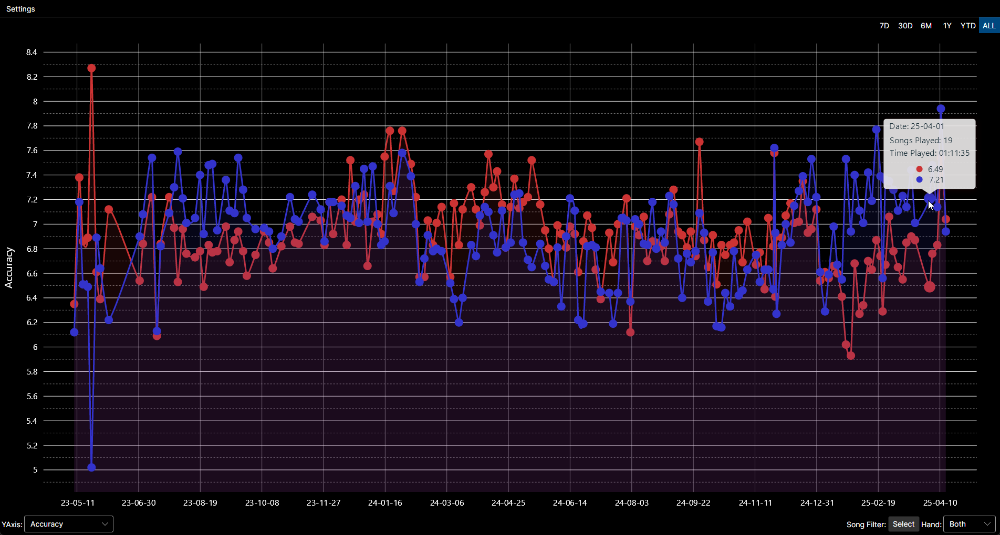

# Beat Saber Replay History Charts

Reads .bsor replays create by BeatLeader mod and charts a variety of data from processing them.
Currently can only display basic overall accuracy and left/right hand accuracy over various time periods.
The data exists to add more charts that I may update in the future.

Uses Avalonia and LiveCharts2.

